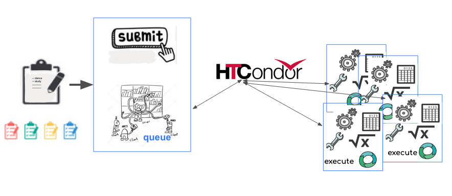

# About HTCondor

HTCondor has revolutioniozed the role computing plays in research for many people. 

HTCondor is a specialized batch system for managing compute-intensive jobs.  Increasing computing throughput by several orders of magnitude may not merely deliver the same results faster, but may enable qualitatively different avenues of research.

HTCondor is a specialized batch system for managing compute-intensive jobs. HTCondor provides a queuing mechanism, scheduling policy, priority scheme, and resource classifications. Users submit their compute jobs to HTCondor, HTCondor puts the jobs in a queue, runs them, and then informs the user as to the result.

Batch systems normally operate only with dedicated machines
Often termed worker nodes,these dedicated machines are typically owned by one group and dedicated to the sole purpose of running compute jobs. HTCondor can schedule jobs on dedicated machines

But unlike traditional batch systems, HTCondor is also designed to run jobs on machines shared and used by other systems or people. By running on these shared resources, HTCondor can effectively harness all machines throughout a campus. This is important because often an organization has more latent, idle computers than any single department or group otherwise has access to.

 



