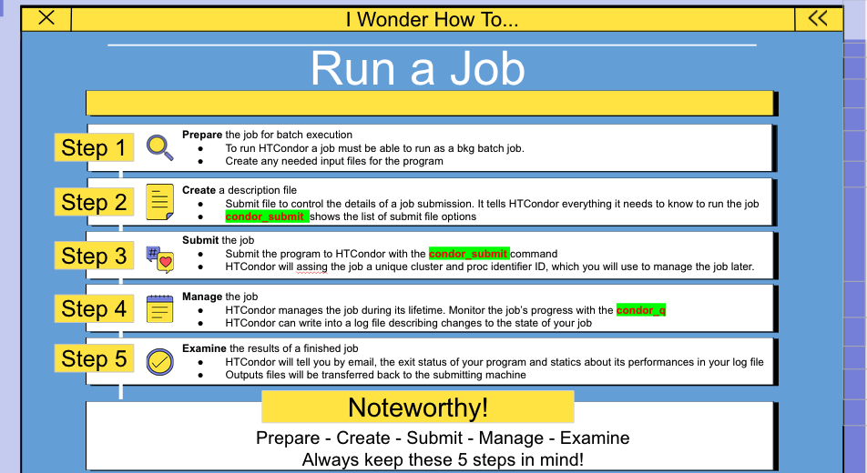

## Terminology: *Job*

  > - Job : an independently-scheduled unit of computing work
  >
  > - 3 main pieces :
  >         - Executable: script to run.
  >         - Input:  input arguments and/or file based information.
  >         - Output: any files or display information produced by the executable.
  > - In order to run many jobs, executable must run on the command line without any graphical input from the user
  > - Machine : Computer, with CPU cores, memory, disk
  > - Slots : Asignable unit of a machine, i.e. 1 job per slot.
  > - HTCondor can split and create new slots. 
  > 

## Work Decomposition
Typically, users want High Throughput computing systems when they have more work than can reasonably run on a single machine. Therefore, the computation must run concurrently on multiple machines. In many cases, such as Monte Carlo simulations, this may be trivial to do. In other situations, the code must be refactored or code loops may need to be broken into separate work steps in order to be suitable for High Throughput computing. Work must be broken down into a set of jobs whose runtime is neither too short nor too long. HTCondor is most efficient when running jobs whose runtime is measured in minutes or hours. There is overhead in scheduling each job, which is why very short jobs (measured in seconds) do not work well. On the other hand, if a job takes many days to run, there is the threat of losing work in progress should the job or the server it runs on crashes.



